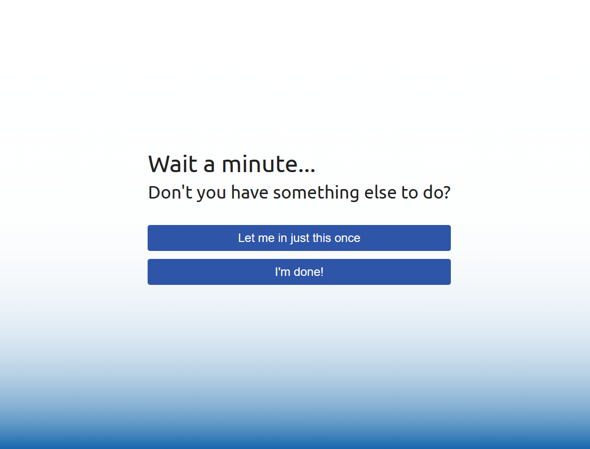
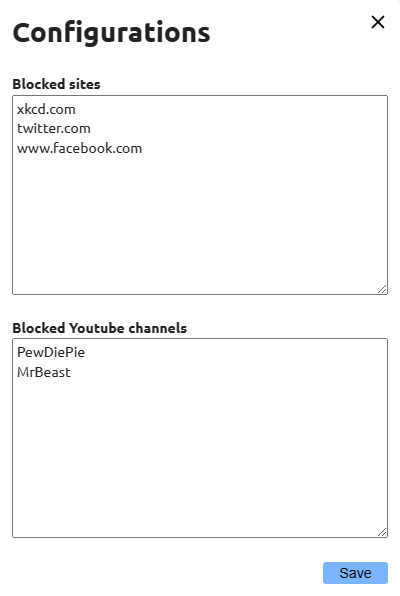

<header>
<h1>Focus Shepherd</h1>

Why I wrote a TamperMonkey script for mindful internet browsing

<a href="https://github.com/Kenneth-LJS/Focus-Shepherd" target="_blank" rel="noopener noreferrer">GitHub</a> | 
<a href="https://github.com/Kenneth-LJS/Focus-Shepherd/raw/main/focus-shepherd.user.js" target="_blank" rel="noopener noreferrer">Install</a>

</header>

## Attention Please!

I’m an easily-distracted person. Whenever I’m bored, my fingers instinctively open a new browser tab with `ctrl-T` and type in the URL to social media platforms. Before I’m even aware of what I’m doing, I find myself face to face with a deluge of visual and mental stimulation, taking up my time and attention for the next few hours.

Am I to blame for the hours of unproductivity? Yes, but only to a certain extent. The thing is, websites profit off your attention. When you watch an advertisement on their platform, they make money, and so they are incentivised to keep you endlessly scrolling to the next social media post, automatically showing you the next video on your feed, or filling in yet another “What’s Your Spirit Animal?” quiz.

Companies use psychological tactics to keep you coming back, whether consciously or otherwise. After reading “Hooked” by Nir Eyal[url], I learnt a lot about how these platforms and apps are fighting for our attention.

It’s scary, really, how subconscious it’s become. A 1-minute trip to the washroom is accompanied by a quick scroll on Facebook. The moment we’re waiting at the bus stop or train station, out comes Twitter before we’re even aware of what we’re doing. Just to get a feel of how powerful these impulses are, just for one day, switch up the positions of your social media apps on your phone. Watch how your fingers automatically tap on where the app used to be, the moment you’re looking for that temporary stimulation.

Don’t get me wrong, I’m not advocating banning all these apps. I do think in the right time and place, it can be a good source of fun. The key idea is to achieve the balance of entertainment and productivity.

## Existing Solutions

Since I’m dealing with online distractions, a good place to start is to find a Anti-Distraction browser plugin. After trying out a few plugins, I’ve decided that these are not for me. Most of them have a “hard” limit: you specify a length of time you’d like to focus, and you’re stuck with it until the time is up. Some of these will block common social media sites, with options for customising the block list.

Another feature of these Anti-Distraction apps is scheduled focus times. You can specify the time of day you’d like to block these sites, and these will come into effect automatically.

Some desktop apps even go the extra mile to block everything. Even if you close the app or restart the computer, your favourite sites are blocked. Nothing short of a full factory reset will save you there.

The thing is, even with hard limits in place, nothing stops you from turning to your phone to alleviate the boredom. If you’ve installed an anti-distraction app on your phone too, then there’s always the television. What I’m trying to say is that these solutions solve the symptoms of the distraction problem, but not the root of it.
## Mindfulness

The first step to reclaiming our focus is to be mindful. We need to be aware of the times we turn to social media for that brief moment of distraction, then stop ourselves. This is a skill that can be trained over time. After we’ve learned to control these impulses, this skill carries across all sorts of distractions, from mobile devices to the television too.

## Focus Shepherd

This is why I came up with Focus Shepherd. Rather than having hard limits to what you can access, Focus Shepherd is a browser plugin that gently reminds you to return to focus. When you need to focus, all you have to do is to open TamperMonkey and click “Enter Focus Mode”. While in focus mode, if you navigate to unproductive sites on impulse, the following screen will show:

  

Instead of restricting your surfing, it reminds you that you should be focusing. That reminder helps you step back from that automatic response and ask yourself if you really want to allow this distraction. You can still click “Let me in” to allow yourself a short break if you need it, but otherwise you can close the window.

Sometimes, after 30 minutes of trying to do work, you realise that you need a proper break to step away and refresh your mind. In that case, you can click “I’m done!” to end the focus session, no pressure. The key idea is that you’re making this decision consciously, rather than impulsively.

## Other Features

There’s a configuration window that lets you set up a list of websites to block when you want to focus. Some websites that are distracting for others may be essential for work. For example, your marketing job may need you to be on Facebook for 8 hours a day. On the other hand, productive sites (e.g. news) can turn into endless hours of article-surfing. Add that straight to your block list!

  

Another feature is that when you enter focus mode, all open tabs will also be checked and blocked accordingly. Don’t worry, when you exit focus mode, your tabs will return to normal. This is an issue for some Anti-Distraction plugins, where they redirect or close your browser tabs if they are blocked. Even if they refresh the page, you might lose your position in the infinite-scroll page. Not cool. If anything, fear of losing my browser tabs is why I end up refraining from entering focus mode in the first place. (I’m looking at you, StayFocusd).

This doesn’t happen with Focus Shepherd. Instead, the screen is overlaid over your original tab, so you don’t lose your browser tab, your half-typed Tweet, or even your scroll position.

## Productivity!

I’m a bit of a workaholic. After a long day of work, nothing beats coming back home to indulge myself in a fulfilling time of building personal projects. Focus is important to me, and Focus Shepherd has done a good job of bringing my attention back to where it needs to be. On the days that I don’t feel up for an after-work grind, Focus Shepherd lets me say no, allowing me to spend the rest of the night watching some YouTube videos. When this happens, there’s no fretting about an unproductive night, because the distraction is a conscious decision for rest.

If you want, you can install Focus Shepherd <a href="https://github.com/Kenneth-LJS/Focus-Shepherd" target="_blank" rel="noopener noreferrer">here</a>, or view the source code <a href="https://github.com/Kenneth-LJS/Focus-Shepherd" target="_blank" rel="noopener noreferrer">here</a>. Let’s be more careful about where our attention is being drawn to, and practise mindfulness!

## Bonus!

I also wrote another TamperMonkey script to stop me from endlessly surfing videos on YouTube shorts. No more autoplaying videos for hours! Download it <a href="https://github.com/Kenneth-LJS/No-YT-Shorts" target="_blank" rel="noopener noreferrer">here</a>.
