<header>
<h1>Introduction to Domsi</h1>

<p>
  Unleash the true potential of web-scraping through Domsi, a web scraping library that exploits DOM hierarchy.
</p>

<p>
  <a href="https://github.com/Kenneth-LJS/domsi" target="_blank" rel="noopener noreferrer">GitHub</a> | <a href="https://www.npmjs.com/package/domsi" target="_blank" rel="noopener noreferrer">NPM</a> | <a href="/static/kiwi-chirp/" target="_blank" rel="noopener noreferrer">Demo</a>
</p>

</header>

## Scraping with Domsi

Web scraping is hard! It’s been a long time since we’ve had websites with simple CSS classes like `.header` and `.username` that we could query and scrape. These days, we have to deal with pesky utility classes and compiled CSS modules that obfuscate the fields we are looking for. Even if we find some way to scrape website data based on these CSS class names, these queries are bound to break on the next build when the CSS class names change again.

To get a feel of this problem, let’s try scraping the social media posts of this mock website I put together: <a href="./static/kiwi-chirp/" target="_blank" rel="noopener noreferrer">Kiwi Chirp</a>. Can you write a selector in order to scrape all the social media posts on this page? Your aim is to get the content of all 7 posts, along with their respective poster’s name and user ID. Go on, give it a go!

<p align=center>
  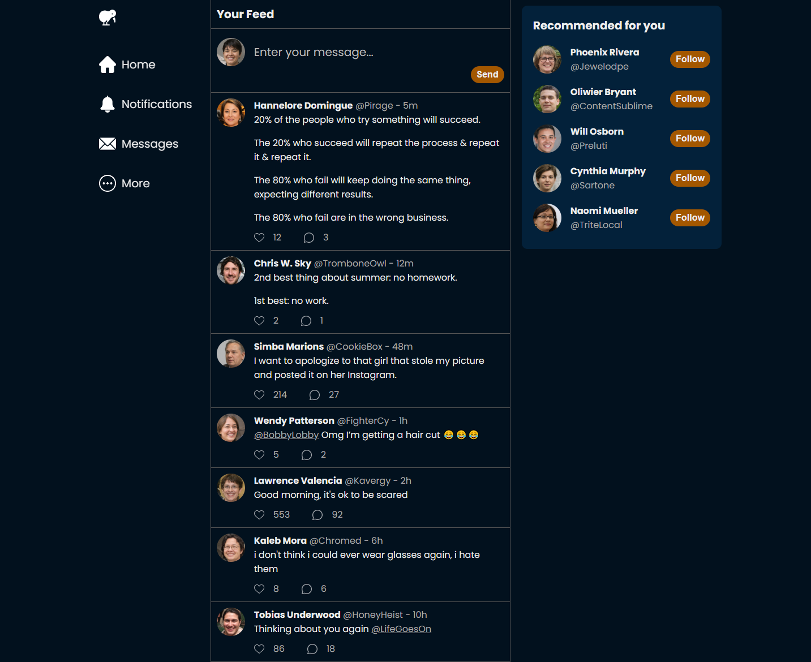<br/>
  <em>Your adversary for today: the Kiwi Chirp website.</em>
</p>

If you’ve made an attempt, you’ll find that the task is non-trivial. Attempting to scrape anything by attributes, styles, or roles alone is difficult, since there are many overlapping properties. For instance, trying to query the user ID (i.e. elements that start with “@”) will give us the elements in the posts, but also those in the “Recommended” bar. That’s not ideal, but let’s use this as a starting point.

Let’s query all the elements that start with an “@”. Open the developer console on the Kiwi Chirp page and run the following command:

```javascript
Array.from(document.querySelectorAll('*')).filter((elem) =>
    elem.textContent.startsWith('@')
);
```

It seems like we’re getting all the elements we want, but we’re also getting a few extra elements. Ugh.

Another option is to exploit the `dir="auto"` property that’s found on the post content.

```javascript
document.querySelectorAll('*[dir="auto"]');
```

That’s pretty close too, but we get some stray elements too. Nothing short of a hacky method will solve this issue.

The frustrating thing is, websites are so easy for users to read. There’s a nice hierarchy of elements that lead our eyes through the webpage and communicate the structure of the information. Can we somehow take advantage of that in a way that doesn’t require horrible parent-child element traversals?

Meet Domsi. “Dom” as in “Document Object Model”, and “Si” as in “See”. The goal of this library is to query elements by what we can see: CSS styles, text content, and hierarchy. To show you how easy it is to do this, let’s start with a simple Domsi selector.

```javascript
{ tagName: 'a' }
```

Nothing impressive, we’re just finding all the anchor elements on the page. But let’s give it a go anyway. Head over to the Kiwi page. Domsi should already be loaded globally, so you can go ahead and use it with `domsi.find` or `domsi.findAll`. Let’s run the following code in the console:

```javascript
domsi.findAll({ tagName: 'a' });
```

Let’s take a look at the results. We have 26 elements in the result, and each one takes the following shape:

```javascript
{
    node: <HTML Element>,
    children: {}
}
```

If you check each node in the DOM, you’ll find the respective element for each result. Alright, we’ve gotten all the anchor elements. But what if we also want to filter it by the text content like we did earlier? That’s easy, all we have to do is to add an additional `text` filter that filters out element text content with a Regex.

```javascript
domsi.findAll({
    tagName: 'a',
    text: {
        type: 'regex',
        regex: '^@',
    },
});
```

In fact, while we’re here, let’s make the selector more specific by filtering out the elements with a specific font size, weight, and color.

```javascript
domsi.findAll({
    tagName: 'a',
    text: {
        type: 'regex',
        regex: '^@',
    },
    css: {
        fontSize: '16px',
        fontWeight: '400',
        color: '#AAAAAA',
    },
});
```

There’s also an `attribute` and `property` field that allows us to query elements by their attributes and properties respectively, but I won’t go into it here. After all, what we have here is pretty powerful, and gives us a good way to query specific elements on the page. But we’re still not at the point where we can scrape all the posts on this page. So what’s next?

Let’s take advantage of Domsi’s children selector. Let’s take our earlier selector and assign it to a `userIdSelector` variable.

```javascript
var userIdSelector = {
    tagName: 'a',
    text: {
        type: 'regex',
        regex: '^@',
    },
    css: {
        fontSize: '16px',
        fontWeight: '400',
        color: '#AAAAAA',
    },
};
```

Let’s also add a `usernameSelector` too. This selector looks out for the usernames on the social media posts.

```javascript
var usernameSelector = {
    tagName: 'a',
    css: {
        fontSize: '16px',
        fontWeight: '700',
        color: '#EEEEEE',
    },
};
```

Now for the fun part. Run the following query:

```javascript
var userInfoSelector = {
    children: {
        username: {
            type: 'single',
            selector: usernameSelector,
        },
        userId: {
            type: 'single',
            selector: userIdSelector,
        },
    },
};

domsi.findAll(userInfoSelector);
```

We’re trying to query the div in the post that contains both the username and the user ID. The `children` property allows us to specify a `username` and a `userId` child. The type is `single` since we’re only expecting 1 element of each, and the selector simply references the earlier selector.

Looking at the results, we’re really close now. We’ve found the header element of each post, allowing us to scrape the data easily. However, we’re still getting the additional elements in the “Recommended” bar.

Fret not! We realize that the text in the sidebar includes a newline in the text content, since the username and the user ID takes up 2 rows. We can simply use the Regex selector from earlier, except now we invert the value with a `not` selector.

```javascript
var userInfoSelector = {
    text: {
        type: 'not',
        operand: {
            type: 'regex',
            regex: '\n',
        },
    },
    children: {
        username: {
            type: 'single',
            selector: usernameSelector,
        },
        userId: {
            type: 'single',
            selector: userIdSelector,
        },
    },
};

domsi.findAll(userInfoSelector);
```

And there! We’ve created a selector which finds the exact elements we’re looking to scrape. With a bit more effort, we can put together a more complex selector.

```javascript
var profileImgSelector = {
    tagName: 'img',
    css: {
        width: '50px',
        height: '50px',
    },
};

var usernameSelector = {
    tagName: 'a',
    css: {
        fontSize: '16px',
        fontWeight: '700',
        color: '#EEEEEE',
    },
};

var userIdSelector = {
    tagName: 'a',
    text: {
        type: 'regex',
        regex: '^@',
    },
    css: {
        fontSize: '16px',
        fontWeight: '400',
        color: '#AAAAAA',
    },
};

var timestampSelector = {
    tagName: 'span',
};

var postHeaderSelector = {
    tagName: 'div',
    children: {
        username: {
            type: 'single',
            selector: usernameSelector,
        },
        userId: {
            type: 'single',
            selector: userIdSelector,
        },
        timestamp: {
            type: 'single',
            selector: timestampSelector,
        },
    },
};

var contentSelector = {
    attribute: {
        dir: 'auto',
    },
};

var likeCountSelector = {
    tagName: 'span',
};

var likeIconSelector = {
    attribute: {
        'aria-label': 'Like',
    },
};

var likeContainerSelector = {
    children: {
        likeCount: {
            type: 'single',
            selector: likeCountSelector,
        },
        likeIcon: {
            type: 'single',
            selector: likeIconSelector,
        },
    },
};

var commentCountSelector = {
    tagName: 'span',
};

var commentIconSelector = {
    attribute: {
        'aria-label': 'Comment',
    },
};

var commentContainerSelector = {
    children: {
        commentCount: {
            type: 'single',
            selector: commentCountSelector,
        },
        commentIcon: {
            type: 'single',
            selector: commentIconSelector,
        },
    },
};

var postFooterSelector = {
    tagName: 'div',
    children: {
        likeContainer: {
            type: 'single',
            transparent: true,
            selector: likeContainerSelector,
        },
        commentContainer: {
            type: 'single',
            transparent: true,
            selector: commentContainerSelector,
        },
    },
};

var postSelector = {
    tagName: 'div',
    children: {
        profileImg: {
            type: 'single',
            selector: profileImgSelector,
        },
        postHeader: {
            type: 'single',
            transparent: true,
            selector: postHeaderSelector,
        },
        postFooter: {
            type: 'single',
            transparent: true,
            selector: postFooterSelector,
        },
        content: {
            type: 'single',
            selector: contentSelector,
        },
    },
};

var results = domsi.findAll(postSelector);
results;
```

And there you go, all the respective elements are queried. Let’s check out the results this time.

```javascript
{
    node: <HTML Element>,
    children: {
        username: { node: <HTML Element>, children: {} },
        userId: { node: <HTML Element>, children: {} },
        content: { node: <HTML Element>, children: {} },
        timestamp: { node: <HTML Element>, children: {} },
        profileImg: { node: <HTML Element>, children: {} },
        content: { node: <HTML Element>, children: {} },
        likeCount: { node: <HTML Element>, children: {} },
        commentCount: { node: <HTML Element>, children: {} },
        ...
    }
}
```

Notice how the fields under the `children` property matches the names we gave the child selectors? We can use that to look up the respective elements. Now, we can simply look up the property of each child element to scrape the data.

```javascript
var data = results.map((result) => {
    const {
        profileImg,
        username,
        userId,
        timestamp,
        likeCount,
        commentCount,
        content,
    } = result.children;

    return {
        profileImg: profileImg.node.src,
        username: username.node.textContent,
        userId: userId.node.textContent,
        timestamp: timestamp.node.textContent,
        profileUrl: userId.node.href,
        likeCount: parseInt(likeCount.node.textContent),
        commentCount: parseInt(commentCount.node.textContent),
        content: content.node.innerText,
    };
});
data;
```

And that’s it, we’re done! To recap, we’ve taken a non-trivial problem and reduced it to a bunch of easy-to-understand queries.

## The Power of Domsi

Since Domsi is compiled into pure JavaScript, it can be run on any automated browser of choice, from Puppeteer in Node.js to Selenium in Python. No need to code a Python version of Domsi for data collection!

As for the selector itself, let’s see how it fares against conventional web scraping methods.

Firstly, Domsi selectors have a powerful hierarchy structure built into them. The nested queries allow for complex HTML structures to be easily found without having to rely on Javascript-based filters which may be buggy.

Secondly, Domsi selectors don't need to rely on CSS classes which may change with each build. Instead, it relies on properties and attributes that aren’t likely to change. Properties such as font sizes and border colors largely remain the same as long as the website doesn’t mess around with their themes and layouts.

Thirdly, Domsi selectors do not rely on parent/child node navigation. If the website decides to add additional container divs in between each level, the selector would still work. No more fiddling with finicky nested `.parentElement.parentElement.parentElement` ad infinitum.

Fourthly, the query is self-documenting. Unlike horribly nested parent/child traversals and arbitrary property checks, Domsi queries allow you to label each node with an easy-to-understand selector. This makes development and maintenance much easier. No more tweaking xpaths and selectors! No more throwing out old scraping codes because the monolith of a function no longer works!

And that’s not all! There are a lot more features I havent’ mentioned yet such as the `and` and `or` selectors. Also, when comparing colors, the color selector converts hex values and rgb values under the hood, saving yourself the unnecessary conversion headache. Check out the documentation for more info!

## But How Fast Is It?

Very good question. What if you want to scrape a huge web page with tons of data? If Domsi uses an inefficient method to compute the hierarchy of selectors, then we’re going to end up with a very long runtime.

Fortunately, Domsi uses a blazingly fast algorithm under the hood. The runtime of the query is:

<p align=center>
  <code style="font-size: 3em">O(nmk)</code>
</p>

Where:

-   `n` = number of DOM nodes
-   `m` = number of children selectors
-   `k` = max height of DOM tree

“But wait”, you may ask, “Is it even possible to do it this quickly? After all, the algorithm needs to do a recursive search to check if an element’s children match the selector’s hierarchy.”

Ahah, that’s the genius of it. Let’s walk you through the algorithm. Consider the following nested selector. The red selector contains 2 children: the green and blue selector. The green selector contains 1 child: the yellow selector.

Each of the 4 selectors also have their own fields to filter HTML nodes by their various properties.

<p align=center>
  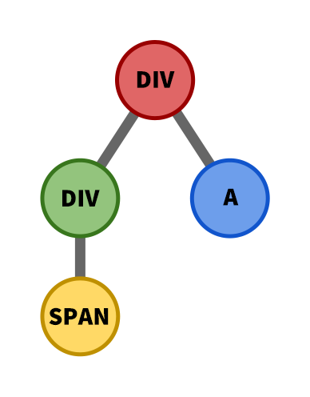
</p>

First, we do a topological sort of the selector’s children. For instance, given the following selector, we will start with the yellow, green, blue, then red selector.

Now let’s take a look at how the selector is used to query the HTML DOM.

<p align=center>
  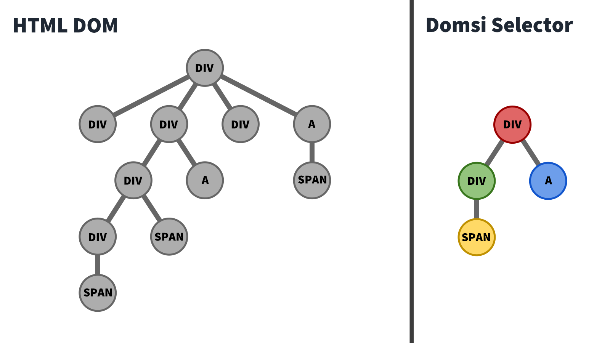
</p>

We start with the yellow selector, since that is the first selector in our topological sort. We see that it matches the following `span` elements in the DOM tree.

<p align=center>
  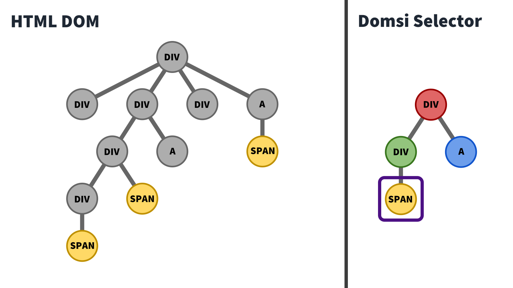
</p>

For each element that matches the selector, we step through its parents and mark them as containing the yellow selector, as indicated by the yellow check mark.

<p align=center>
  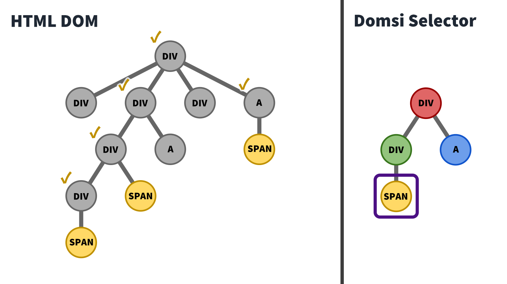
</p>

Next, we move on to the green selector. In this case, the 2 indicated `div`s match the attribute, property, style, text, etc selectors.

<p align=center>
  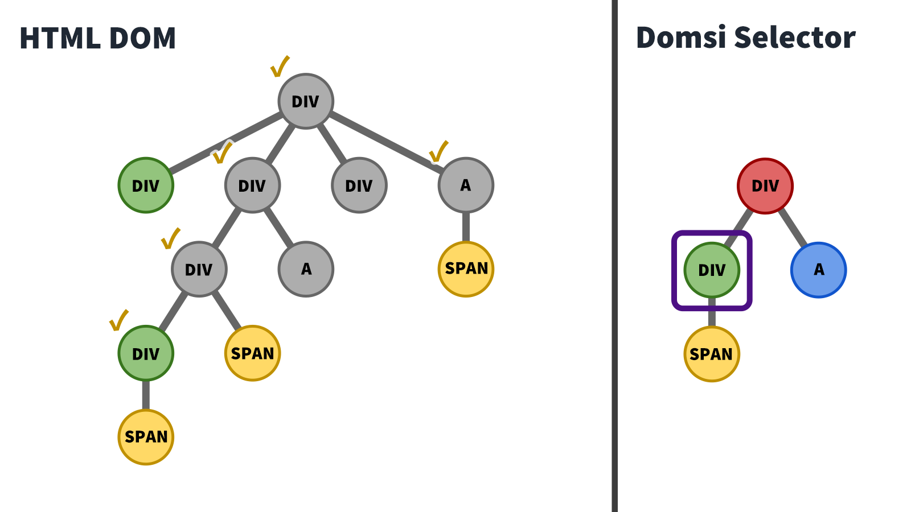
</p>

However, we note that only the bottom `div` node contains the yellow element required, so we mark it as green and ignore the other one. Notice that since the green HTML node already has the yellow child marked, this check runs in O(1) time, reducing the need for a computationally-expensive tree search.

<p align=center>
  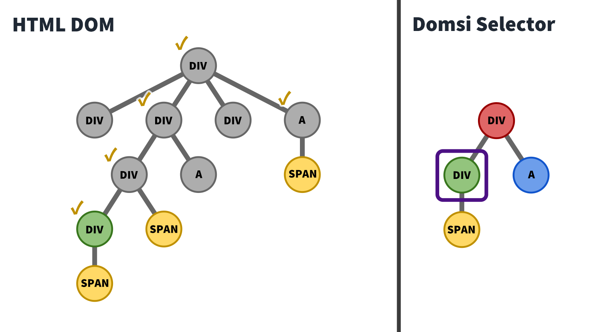
</p>

Again, we mark its parents with the green check mark.

<p align=center>
  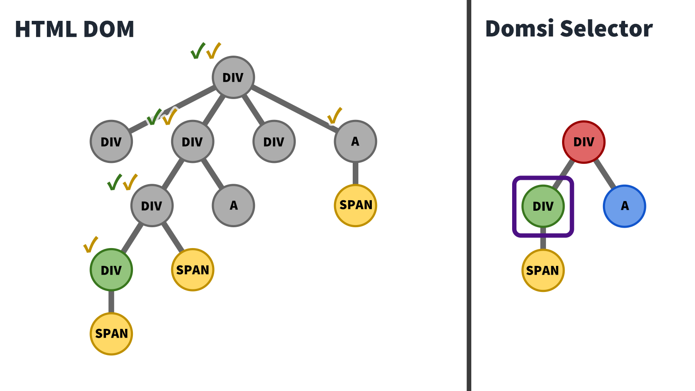
</p>

We repeat this check for the blue selector.

<p align=center>
  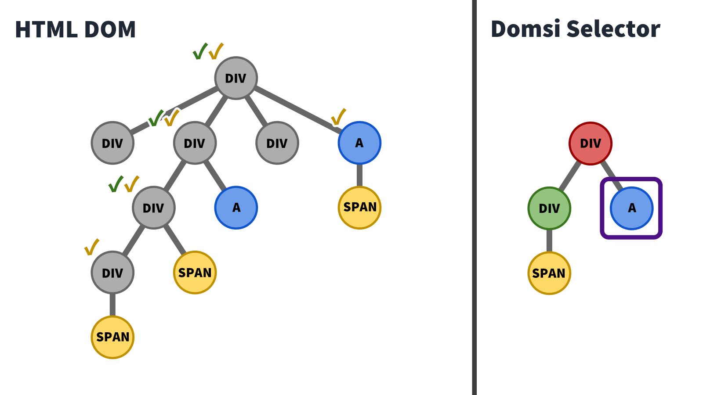
</p>

And then we mark their parents.

<p align=center>
  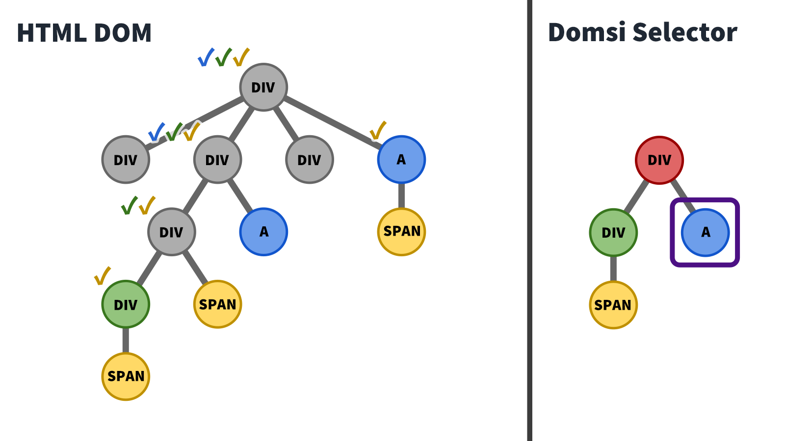
</p>

Now on to the red selector.

<p align=center>
  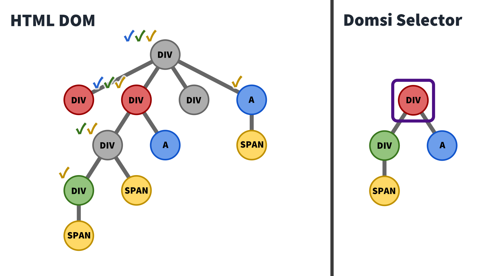
</p>

Again, notice that even though 2 HTML nodes contain the same styles in the red selector, only the second HTML node has the required green and blue children. We then mark it as a red node, and indicate this on its parents.

<p align=center>
  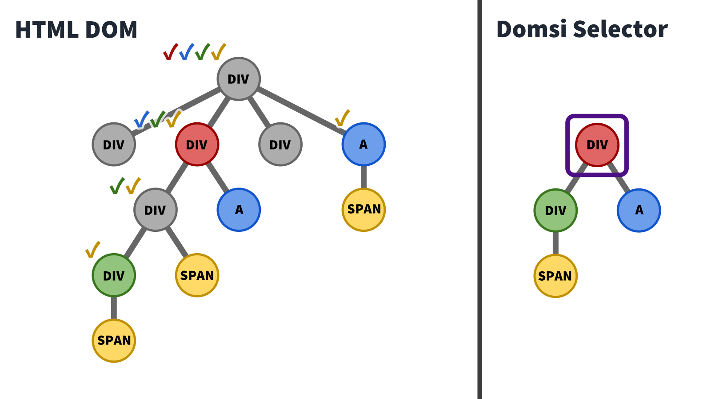
</p>

Again, since the existence of the green and blue HTML children are already marked, this check happens in `O(1)` time. Now, we can return the single red HTML node that was found.

<p align=center>
  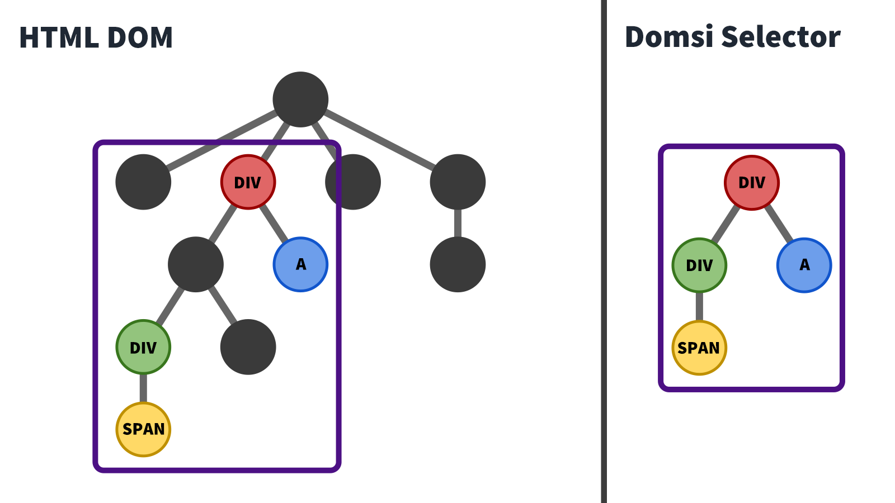
</p>

Let’s compute the runtime.

For each node, let’s assume it takes `O(1)` time to check if the styles and properties match a selector.

The topological sort takes `O(m)` time.

After that, for each of the `m` selectors, we compare it with `n` different elements in the node for `O(nm)` time. Unfortunately, we have to traverse upwards through the DOM tree to mark the existence of a specific child, so that’s an `O(k)` time for each step.

That brings the overall runtime to `O(m) + O(nmk) = O(nmk)`. Unbelievably fast for the functionality of this complexity.

## Future Plans

Well, for one, Domsi could use a bit of refinement. There are a bunch of edge cases such as how the `border-color` property translates into `border-top-color`, `border-bottom-color`, `border-left-color`, and `border-right-color`.

I also want to add additional conditional queries such as value-checking, element size, and comparison of element position between children.

There’s also a tiny bug in the algorithm where the two children of a selector may actually be contained in one, but that’s a really rare edge case.

Either way, there’s still some work to be done. But for now, the Domsi library is already powerful enough for most web scraping needs.

You can check out the <a href="https://github.com/Kenneth-LJS/domsi" target="_blank" rel="noopener noreferrer">Domsi Github Page</a>, or install it from the <a href="https://www.npmjs.com/package/domsi" target="_blank" rel="noopener noreferrer">Node Package Manager</a>.

Happy scraping!
