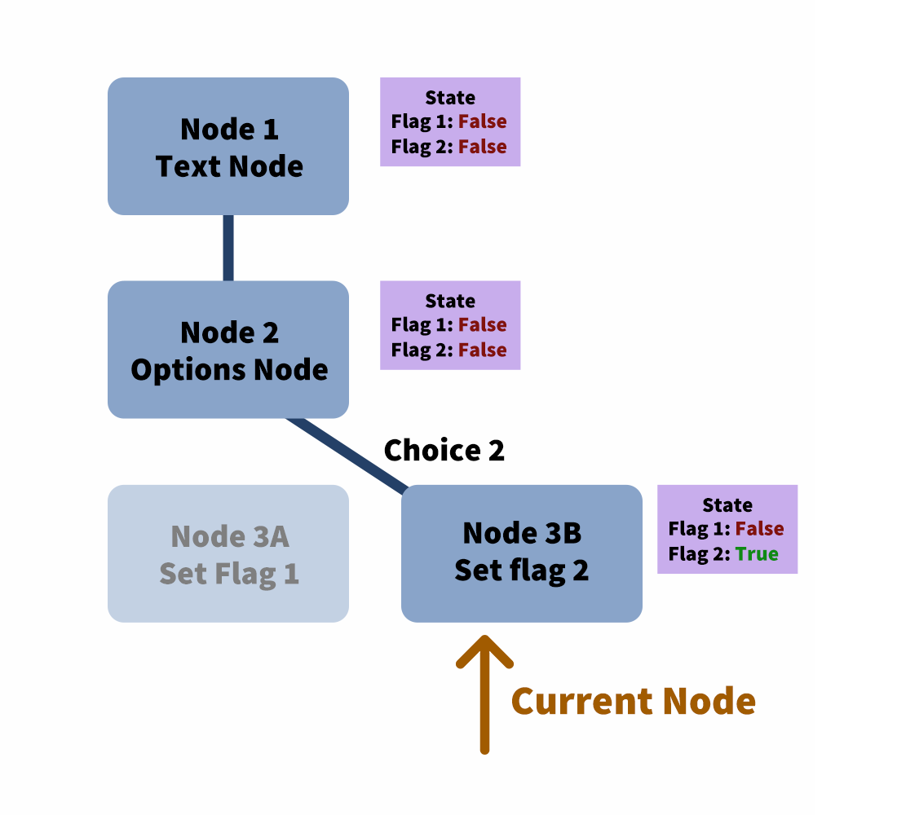
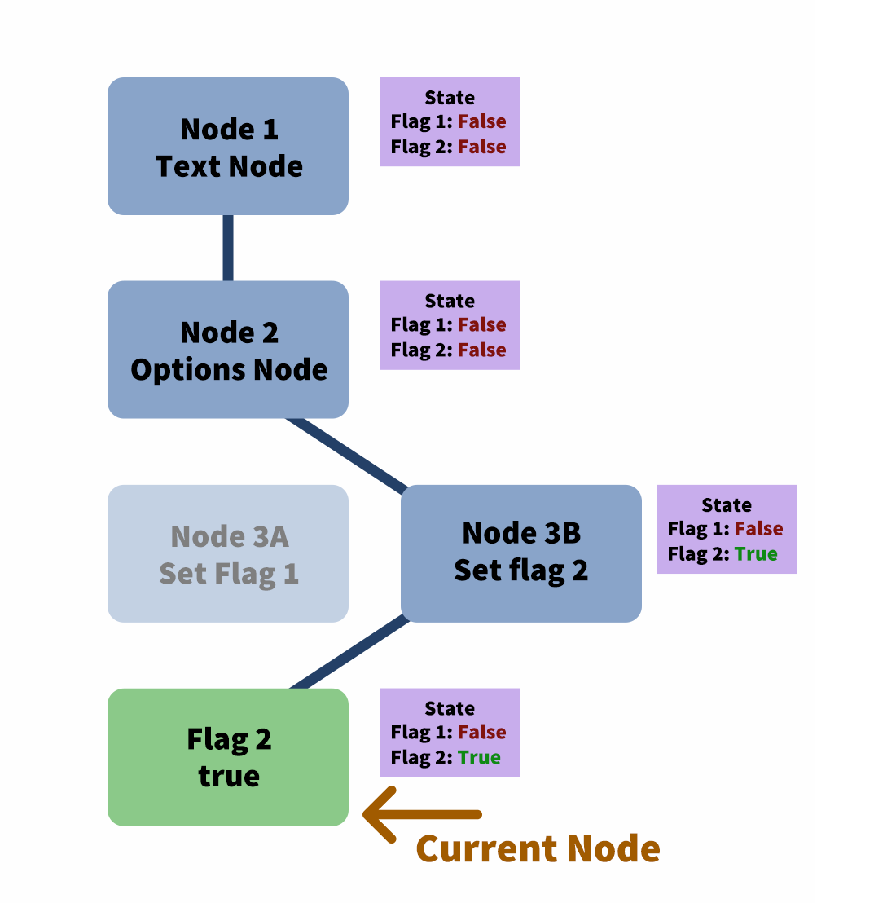

<div style="display: none;">
Outline:
A Victorian Murder Mystery
In 2022, there was an online event that featured a Murder Mystery game. Working with writers and artists, I needed to come up with a game engine for a puzzle.
Gameplay: people find codes hidden in the event posters and website. Then they will have to enter the code to read the story and solve more puzzles
One caveat, the game had to be available for offline play in future through downloading into a HTML file
Building the App
Webpack -> for offline play too, so it had to be 100% local and serverless
The story is written as a JSON file, with separate nodes that can be traversed.
Link to the source code of the story
Problem with serverless: people can read the source code and find the storyline codes
Cryptography to the rescue
Using cryptography signing methods, I encrypted the code
I had to use my own hashing library because offline play = no access to the crypto library in the browser
Each scene is encrypted by its 6-letter code, then the hashed version of the code is prepended to the encrypted story. From there, the scenes are stored in an array.
When the user enters the code, the hashed code is checked against each scene line to find the corresponding scene
Show the built source code
Conclusion:
We found the murderer!
And we’ve thwarted anyone who tried to cheese their way into a solution
</div>
<header>
<h1>Murder Mystery Game</h1>

<p>How I wrote a text-based game engine with Webpack, custom loaders, and a generous serving of cryptography.</p>

<p><a href="#" target="_blank" rel="noopener noreferrer">GitHub</a> | <a href="#" target="_blank" rel="noopener noreferrer">Play the Game</a></p>

</header>

## A Victorian Murder Mystery
During my free time, I enjoy helping out with event organising. In 2022, there was an online event with a Victorian Murder Mystery theme. As part of the event, they wanted to include a puzzle game that the attendees could play.

Working with writers and artists, we put together a simple concept: 6-letter codes would be hidden on the event’s website and in the social media platforms. Observant players could solve the puzzles to get the code, then enter it into the game. Each code would unlock a new chapter of the storyline, with more puzzles to solve to uncover clues that would reveal the murderer.

The 6-letter codes would be hard to find, and the puzzles would range from trivially easy to challenging. We wanted to encourage players to discuss the solutions, and help each other out with hints along the way. Towards the closing of the event, the last 6-letter code would also be revealed, allowing the players to crack the case.

One additional note: the game would be hosted on the event website, but after the event, it should also be downloadable and playable offline. This would come into play later.

*Cue ominous music and foreshadowing.*

## The Engine

As the sole developer of the game engine with only a few weeks to work on this, I had to make this engine simple but powerful. I turned to ol’ reliable: my Webpack boilerplate with React, Typescript, and SCSS.

The first scene was easy enough: a 6-letter input that would accept valid codes and reject invalid ones.

<p align=center>
  <video src="./static/code-desktop.mp4" style="width: min(100%, 800px)" preload="auto" muted autoplay loop playsinline data-wf-ignore="true" data-object-fit="cover">
</p>

I made sure it worked well on mobile devices too.

<p align=center>
  <video src="./static/code-mobile.mp4" style="width: min(100%, 800px)" preload="auto" muted autoplay loop playsinline data-wf-ignore="true" data-object-fit="cover">
</p>

That was the easy part. Once the player has entered a code, we render an interactive chapter. Players needed to choose dialogue options and solve puzzles. I decided the best way to handle this is to store the game data in a JSON format.

Each part of the story would be represented as a node. A `html` node would render HTML.

```json
{
    "type": "html",
    "content": "<p>This is a HTML node!</p>"
}
```


<p align=center>
  
</p>

The HTML renderer also automatically imports images and maps them to the packaged URL. For example, in the above node, the `image.png` URL is changed to `/ab9d827f80c52ae2d928.png`, since Webpack packages files with a custom name with a hash.

Dialogue options would be represented with an `options` node. When the engine reached an `options` node, it would render it and wait for the player’s input. Based on their options, it would choose the next node to jump to.

<p align=center>
  <video src="./static/options.mp4" style="width: min(100%, 400px)" preload="auto" muted autoplay loop playsinline data-wf-ignore="true" data-object-fit="cover">
</p>

This functionality created a lot of complexity for the engine. There were 2 features I wanted. FIrst, I wanted players to be able to backtrack through the dialogue options. If they reached a dead end, they should be able to scroll back to a previous option to select it.

<p align=center>
  <video src="./static/options-backtrack-2.mp4" style="width: min(100%, 800px)" preload="auto" muted autoplay loop playsinline data-wf-ignore="true" data-object-fit="cover">
</p>

The second feature was to have an internal state. If we’re able to store flags, we can remove dialogue options that were already selected.

These two features aren’t trivially compatible. If I only wanted the ability to backtrack, then I can simply keep track of:

The history of nodes rendered
The current node that the player is at

<p align=center>
  
</p>

If the player selects an earlier option, then I can slice off the history at that point…

<p align=center>
  
</p>

…then follow the new option.

<p align=center>
  
</p>

If I only wanted the ability to have an internal state, then I will need to keep track of:

The history of nodes rendered
The current node that the player is at
A global state

For example, consider a game tree that looks like this:

<p align=center>
  
</p>

A player starts the game and reaches node 2.

<p align=center>
  
</p>

They select choice 1.

<p align=center>
  
</p>

Flag 1 is set, and they reach the 4th node where it displays a message based on the flag.

<p align=center>
  
</p>

Let’s say we want both features, meaning we want players to be able to backtrack while keeping an internal state. Let’s see what happens when a player tries to set a flag and backtracks. They step through nodes 1 to 3…

<p align=center>
  
</p>

…but then decides they’d like to go back and pick choice 2 instead.

<p align=center>
  
</p>

Flag 2 is set.

<p align=center>
  
</p>

This time, when they reach the 4th node, both flag 1 and 2 are set, which is supposed to be an invalid state!

<p align=center>
  
</p>

Thankfully, there is a solution. While keeping track of the nodes, I also keep track of the player state at that particular node.

<p align=center>
  
</p>

The player picks choice 1…

<p align=center>
  
</p>

…goes back…

<p align=center>
  
</p>

…and picks choice 2.

<p align=center>
  
</p>

This time, there isn’t an issue because only flag 2 is set. Problem solved!

<p align=center>
  
</p>

From there, I added more node types. There’s a text input node that allows story branching by comparing the input with a string or regex.

```json
{
    "type": "text-input",
    "prompt": "Enter the password",
    "responses": [
        {
            "check": {
                "type": "string",
                "string": "PassWord",
                "isCaseSensitive": true
            },
            "action": {
                "type": "goto",
                "goto": "success-node"
            }
        },
        {
            "check": {
                "type": "regex",
                "regex": "^password$",
                "regexFlags": "i"
            },
            "action": {
                "type": "message",
                "message": "You are close, but the password is case sensitive."
            }
        }
    ],
    "fallthroughResponse": "Incorrect."
}
```

<p align=center>
  <video src="./static/text-node.mp4" style="width: min(100%, 800px)" preload="auto" muted autoplay loop playsinline data-wf-ignore="true" data-object-fit="cover">
</p>

There’s also an image node that allows users to click on various parts of the image to choose an option. First, we need a map of where the clickable areas are.

<p align=center>
  
</p>

After that, we specify the actions to perform when the player clicks on each respective colour.

```json
{
    "type": "click-image-input",
    "prompt": "Click to investigate",
    "image": "image.png",
    "clickMap": "image-click-map.png",
    "clickActions": {
        "#00ff00": {
            "type": "goto",
            "goto": "click-dragon"
        },
        "#0000ff": {
            "type": "goto",
            "goto": "click-dragon"
        },
        "#ffff00": {
            "type": "goto",
            "goto": "click-backpack"
        },
        "#ff0000": {
            "type": "message",
            "message": "“Hey, sweety!”"
        },
        "#00ffff": {
            "type": "message",
            "message": "!"
        }
    },
    "fallthroughResponse": "Nothing here…"
}
```

<p align=center>
  <video src="./static/click-image-node.mp4" style="width: min(100%, 800px)" preload="auto" muted autoplay loop playsinline data-wf-ignore="true" data-object-fit="cover">
</p>

And a penalty node to discourage players from brute-forcing the answer.

```json
{
    "type": "penalty-kick-to-start",
    "delay": 5000,
    "content": "Incorrect."
}
```

<p align=center>
  <video src="./static/penalty-node.mp4" style="width: min(100%, 800px)" preload="auto" muted autoplay loop playsinline data-wf-ignore="true" data-object-fit="cover">
</p>

Now, we can code the story in the JSON format and we’re good to go! Or are we?

## A Gaping Flaw

Remember when I said we needed the game to be playable offline? That meant that we couldn’t rely on a server to check if the 6-letter codes were valid. All the information had to be stored on the frontend: codes, storyline, and all.

That meant if a tech-savvy player dug around in the source, they would quickly find all the 6-letter codes as well as the entire storyline. If they wanted to, they could also spoil the ending even before we released the final chapter. Not cool.

Thankfully, my inner nerd came to the rescue. Over the years, I’ve dug into cryptography concepts and familiarised myself with concepts such as encryption and digital signatures. This would be helpful.

### A Naive Solution

The simple approach would be to serialise every chapter’s JSON into a string and encrypt it with the 6-letter code as the key. All the encrypted strings are then stored in an array.


<p align=center>
  
</p>

When a user enters the code, the engine would attempt to decrypt all the chapters. If any of the chapters was successfully decrypted, then it meant that it was a valid code and we let the player access it. Otherwise, we reject it.


<p align=center>
  
</p>

Is it secure? Yes. But it’s also very slow. Each chapter can reach lengths of up to 34,000 characters once serialised. It would be very computationally intensive to attempt to decrypt the entire story’s worth of chapters each time the user enters a 6-letter code, even if an incorrect code was entered.

Can we do better?

### A Better Way

It turns out that we don’t need to decrypt the entire string. Instead of only storing the encrypted chapter, we can hash the 6-letter code and prepend it to the start of the encrypted chapter.


<p align=center>
  
</p>

When the player enters a code, we hash it and compare it to all the hashed codes. We only need to attempt to decrypt the chapter whose hash matches.


<p align=center>
  
</p>

This looks good! But now we have one more issue: because the game has to be viewable offline, it needs to also work in a local file context. This means that the browser’s crypto API is not always available. We’ll need to implement an encryption and decryption function ourselves (uh-oh), and ideally keep it simple (double uh-oh). Thankfully, since we aren’t dealing with sensitive data, we can get away with this. Yay!

I implemented a simple hash function to move the bits around:

```typescript
function hash(str: string) {
    let hash = 0;
    const strBytes = stringToBytes(str);
    for (let i = 0; i < strBytes.length; i++) {
        hash = (hash << 5) - hash + strBytes[i];
        hash |= 0; // Convert to 32-bit integer
    }
    hash ^= 1249284; // Just to mess some bits around
    return hash;
}
```

The encryption function is an XOR cipher that uses the 6-letter code as the key.

```typescript
function xorBytesWithKey(bytes: number[], keyBytes: number[]) {
    return bytes.map((byte, i) => byte ^ keyBytes[i % keyBytes.length]);
}
```

This method was inspired by how digital signatures work, where the hash of the document is encrypted with a private key and attached to the original document as the signature. The verifier can compare the hash of the document to the signature decrypted with the public key to ensure that the signature is valid. In our use case, we’re pairing the hash of the passcode (to verify a match) with the original document (encrypted by the passcode). Neither the passcode nor the original document is revealed to a potential attacker.

The result is an array of encrypted strings with a prepended hash, each one representing a serialised chapter JSON.

But does it work?

Yes! I sent this to a friend who works in digital security to crack. He pored over the minified code and eventually found the cryptography functions and encrypted strings. When he realised there was no way to cheat the system without knowing the 6-letter codes, he conceded defeat. He did, however, leave me with the following statement: “But you do realise it’s easy for me to brute-force all 6-letter combinations if I wanted to, right?”

Fine, you win Jason. But hey, if we wanted the data to be secure, we would be asking for 128-bit keys rather than 6-letter codes (which amount to just above 28 bits). The idea isn’t to make the code uncrackable, it’s to make it more difficult than actually solving the puzzles.

With that, we’re done with the encryption. Now, whenever we write a chapter, all we have to do is to encrypt it, prepend the hash of its 6-letter code, then add it to the array. Easy, right? Most definitely not!

## Webpack to the Rescue

The best way to get me to code is to present me with a mind-numbingly banal task, because I’ll write a script to automate the heck out of it.

Thankfully, Webpack allows us to write custom loaders. I added a filter to take in JSON files with the `.puzzle.json` extension, and convert it into the encrypted array of strings.

webpack.config
```javascript
module.exports = {
    ...
    module: {
        rules: {
            ...
            {
                test: /\.puzzle.json$/i,
                type: 'javascript/auto',
                use: [
                    {
                        loader: 'json-loader',
                    },
                    {
                        loader: path.resolve('loaders/puzzle-json.js'),
                    },
                ],
            }
        }
    }
}
```

loaders/puzzle-json.ts
```javascript
import { encodeSecretString } from '../puzzle-crypto';

type PuzzleJson = {
    [passcode: string]: PuzzleData;
}

function puzzleJsonLoader(source: string): string {
    // `source` is the loaded string of the puzzle JSON file
    const puzzleJson = JSON.parse(source) as PuzzleJson;
    const transformedPuzzleJson = transformPuzzleJson(puzzleJson);
    const transformedSource = JSON.stringify(transformedPuzzleJson);
    return transformedSource;
}

function transformPuzzleJson(puzzleJson: PuzzleJson): string[] {
    return Object.keys(puzzleJson).map((passcode) => {
        const puzzleData = puzzleJson[passcode];
        return encodeSecretString(passcode, puzzleData);
    });
}

module.exports = puzzleJsonLoader;
```

So the input file may look something like this:

```json
{ 
    "LITTLE": <story json>
    "ISLAND": <story json>
    …
}
```

And the encrypted result looks like this:

```JSON
[
    "8pJavgF0sHAA0XGCcbEAlHVlhYVgIKCAw...",
    "EeqguQElEfFQ8WHT0DBQtGU0JAQwALDRY...",
    ...
]
```

All I have to do is import it in the code as such:

```javascript
import Puzzle from '../data.puzzle.json';
```

And Webpack does everything for me. It’s a lifesaver during the development process, since I could edit the JSON in development mode, and have it refresh instantly. Easy! 

## Case Closed

The game engine was deployed to the website along with the encrypted story, and the event’s attendees got to cracking the case. By the time the event came to a close, the attendees have solved the murder mystery, and our detectives ride their horse-drawn carriage into the sunset.

And while we may enjoy a happy ending, the true treasure was the programming concepts we learnt along the way.

If you’d like to take a crack at solving this mystery, you can check it out <a href="/project/victorian-murder-mystery/" target="_blank" rel="noopener noreferrer">here</a>! The 6-letter codes are listed below:

- Chapter 1: LISTEN
- Chapter 2: MINION
- Chapter 3: SILENT
- Chapter 4: SENSES
- Chapter 5: SWORDS
- Chapter 6: LITTLE, ISLAND, FURCON
- Chapter 7: FACADE
- Chapter 8: NOVELS
- Chapter 9: TREPID
- Chapter 10: COFFEE, ACCESS, FIASCO
- Chapter 11: ESCAPE
- Chapter 12: JACKAL
- Chapter 13: VOODOO
- Chapter 14: NUANCE
- Chapter 15: SAFARI
- Chapter 16: FINALE

Happy cracking!
