<header>

<h1>Shard Game Engine</h1>

<p>Writing a game engine (and a story) as a tribute to a RuneScape quest</p>

<p><a href="/project/shard-game/" target="_blank" rel="noopener noreferrer">Play The Game</a> | <a href="/project/shard-game/?game=1oFHSagKPlhLtz_nwhesrETcb8IahRUdabKaIhv2LVRw" target="_blank" rel="noopener noreferrer">Make Your Own</a></p>

</header>

## A Mysterious Quest

In 2018, RuneScape released a new quest called “The Needle Skips”. In it, the player is presented with an enigmatic scenario. There’s a body laying on the ground, with the word “Megan” scrawled in blood nearby. The player also receives a shard of the Needle, a large stone artefact with mysterious powers.

<p align=center>
  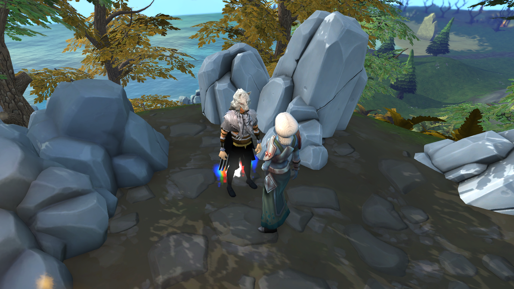
</p>

Throughout the quest, the shard becomes an integral part of the gameplay. The player enters a keyword into the shard, and the right keyword will unlock relevant memories, character dialogue, or a snippet of storyline.

For instance, entering the word “Megan” gives the following dialogue:

<p align=center>
  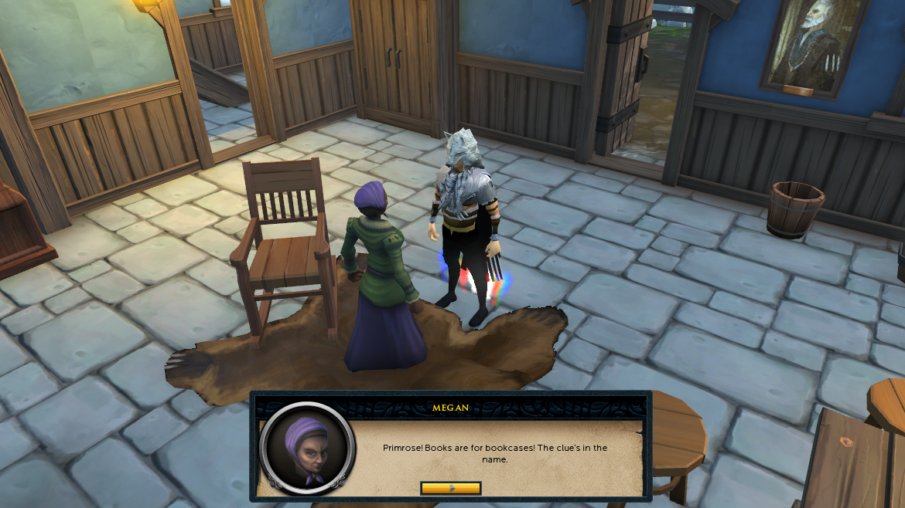
</p>

From there, the player can enter keywords such as “Primrose”, “Book”, and “House” to reveal more of the story until they eventually uncover the truth. Each keyword unlocks a story fragment relevant to it. For  instance, “Primrose” unlocks a description about a girl named Primrose.

To this date, I daresay this is one of the best quests that RuneScape has to offer. As a writer, this story format inspired me to write my own “fragmented” story.

## Death of Immortality

A man enters a church in the midst of a post-apocalyptic desert wasteland. What is his mysterious past? What are his motives? And why is everywhere now a scorching wilderness? Uncover the story in the <a href="/project/shard-game/" target="_blank" rel="noopener noreferrer">Death of Immortality</a>.

Death of Immortality is a tribute to The Needle Skips quest. I wanted to write a story of a man’s life journey, bringing the reader (or player?) through emotional curiosity, concern, frustration, despair, then hopefulness. I got to planning.

The original RuneScape quest featured a lot of walking, pixel-hunting for tiny items in the bushes, and figuring out which items should be combined, which I found a bit tedious. Hence, I distilled the concept down to the core mechanic: unlocking story fragments through keywords.

In essence, all I needed was:

- A way to view story fragments.
- An input box for the player to enter keywords.

I wanted to get a working prototype to experiment with the concept, so I wrote the game engine in a Python script.

<p align=center>
  <video src="./static/python-demo.mp4" style="width: min(100%, 800px)" preload="auto" muted autoplay loop playsinline data-wf-ignore="true" data-object-fit="cover">
</p>

It wasn’t very polished, but it worked! I spent the next few days working on the story and playtesting it with friends. As with designing puzzles, it’s hard to achieve the right difficulty. Too easy, and it’s just a glorified typing practice. Too hard, and players get stuck reading and re-reading the same story fragments and give up in frustration.

After I was happy with the story, I imported the final version of it into the Python engine and published it for people to play. But this project’s journey didn’t end here.

## The Shard Game Engine

The Python game engine had its flaws. The biggest issue was that it was hard for players to keep track of the story fragments they had unlocked. I had to create a `/list` command to list down all the story fragments, and if it was unlocked. I also added a `/view [fragment number]` command to allow users to view a specific fragment without having to search through the console history.

Another issue was that Python scripts aren’t player-friendly. To play the game, the player has to either: (1) install Python to run a script, or (2) run the game that I’ve packaged with `pyinstaller` into a “.exe” file. I could only ask my friends to playtest the game because the script would look suspicious to people who don’t know me well.

I decided to rewrite the engine in Javascript for web browsers. This would solve the two issues I had: I can create a GUI to track story fragments, and players can play the game in their browsers without having to download anything dubious.

I decided to call the new engine the “Shard Game Engine”, since players don’t experience the story linearly, but in “shards”. It’s also a throwback to the “Shard of the Needle” item used in the RuneScape quest. I set up the project in Parcel.js with TypeScript and SASS (no React—I wanted to have more hands-on HTML in this project). I started by creating the layout of the GUI.

<p align=center>
  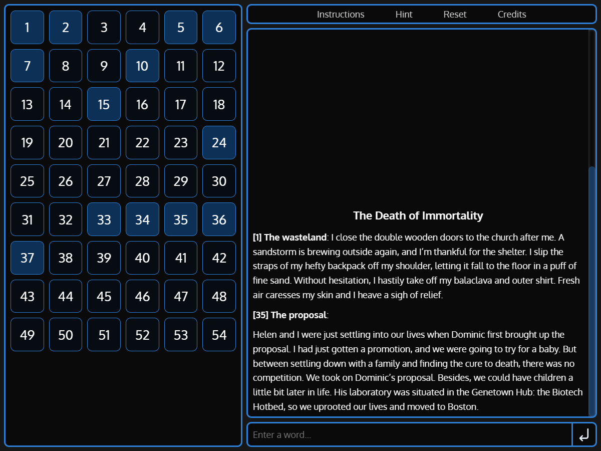
</p>

There are 4 main components:

- The list of shards (on the left side of the screen).
- The display for story fragments (on the middle-right side of the screen).
- The text input area (on the bottom-right of the screen).
- The controls (on the top-right of the screen).

I also designed breakpoints for mobile and tablet devices.

<p align=center>
  <video src="./static/game-resize.mp4" style="width: min(100%, 800px)" preload="auto" muted autoplay loop playsinline data-wf-ignore="true" data-object-fit="cover">
</p>

With that done, I started on the game engine. One of my goals with this engine is to make it easy for people to create their own shard stories. To do that, I represented my story in a JSON format, rather than hard coding it into the game. The game loop is fairly simple:

- The player enters a word.
- If the word is a keyword, unlock the corresponding story shards and display them.
- If the word is a keyword that has already been entered, inform the player.
- If the word is a new keyword, but no new shards are unlocked, inform the player.
- If the word isn’t a keyword, inform the player.

After that, I added functionality for the user to click on the shards on the left to display them. I also designed a hint system that the player can use when they get stuck. It looks for an unlocked shard that has a keyword that can unlock more shards. For instance, if the player has unlocked a few shards:

```plaintextlinebreak
Shard 10: Helen. My dear, sweet, Helen. I miss everything about you. Your soft hair, your sweet lips. I now regret all those years we devoted to our research.

Shard 15: I met Dominic as a college undergrad in Harvard University. We shared a love for tennis, logic puzzles, and rock music. But most importantly, we shared a burning passion for biochemistry.

Shard 35: Helen and I were just settling into our lives when Dominic first brought up the proposal. I had just gotten a promotion, and we were going to try for a baby. But between settling down with a family and finding the cure to death, there was no competition.

```

If the player is stuck and asks for a hint, the game engine finds that shard 33 can be unlocked with the word “death”, which can be found in shard 35. The engine will then show the user shard 33 with the prompt “The end of life” as the hint. All these hints were manually written.

With that, we’re done!

<p align=center>
  <video src="./static/game-demo.mp4" style="width: min(100%, 800px)" preload="auto" muted autoplay loop playsinline data-wf-ignore="true" data-object-fit="cover">
</p>

The game works well, and this time I could playtest it with a wider audience.

## A Customisable Engine

With Death of Immortality completed, I turned my attention to making it easy for people to write their own stories and customise the UI. A story editor with server storage was out of scope for this project, so I decided to scale it down. If an entire story could be written in a text format, then users can write it on Google Docs and host it there. The game engine can pull the story file from a Google Docs link and run it.

While it sounds like a sloppy solution at first, the idea is actually pretty decent. Firstly, Google Docs is a reliable cloud-based text editor that writers can use on their desktop and mobile devices. Secondly, there’s no need to worry about the typical issues that come with the backend: server downtime, DDOSing, security vulnerabilities, and so on. All I need to do is host the static HTML files of the game engine, and let users play with it.

To do that, we first need a way to create a shard story in a text format. Each story fragment (or shard) can be organised in the following format:

```plaintextlinebreak
[Title]
[Keywords]
[Text]
```

The first line is the title of the shard, followed by a line of comma-separated keywords. The remaining lines are the text. To allow for styling, I added markdown support with <a href="https://www.npmjs.com/package/marked" target="_blank" rel="noopener noreferrer">Marked</a> to parse Markdown to HTML, and <a href="https://www.npmjs.com/package/dompurify" target="_blank" rel="noopener noreferrer">DOMPurify</a> to clean up dangerous elements such as user scripts, XSS, and other exploits. The shard blocks are then separated with a `===` break between them. I also made a parser to extract these blocks to generate the story JSON.

After that, it was time to add the bells and whistles. One important feature is keyword aliasing. For instance, if “hurt” is a keyword, then the player should also be able to unlock the shard with “hurts” and “hurting”. To do this, we have a “command block”. If the first line of a block starts with `!`, then we treat the entire block as a command block instead of a shard fragment. For example, this is how I add keyword aliases:

```plaintextlinebreak
!keyword
hurt = hurts, hurting
colour = color
eye = eyes
```

Hints can be added to story shards to help guide the player when they get stuck. For instance, hint example can be defined as such:

```plaintextlinebreak
The proposal
Dominic, proposal, promotion, baby
Helen and I were just settling into our lives when Dominic first brought up the proposal. I had just gotten a promotion, and we were going to try for a baby. But between settling down with a family and finding the cure to death, there was no competition.
!hint
death, 1, The end of life
```

So the first line is the title of the shard: “The proposal”. The second line lists the 4 keywords, any of which could be used to unlock this shard. The next few lines are the shard content, then the hint follows after `!hint`.

The hint takes the following format: `[keyword], [importance level], [prompt]`. If the player has not yet unlocked a shard with the keyword “death”, then the game will point them to the shard with the hint “The end of life”. The importance level is a number. If multiple hints are available, a hint with a lower importance will be shown first. This allows the writer to show hints to unlock shards that are earlier in the story, saving up the climax and finale shards for last.

`!image` block lets the user insert an image into Google Docs (another advantage over simply having a text file), which can be referenced anywhere in the game.

<p align=center>
  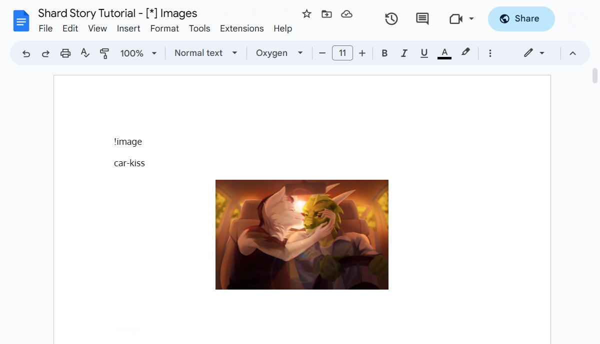
</p>

<p align=center>
  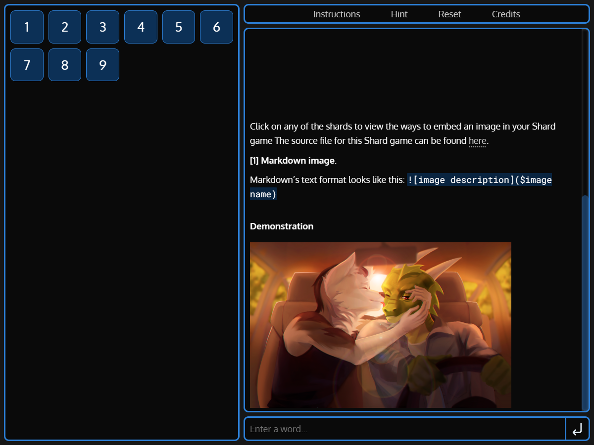
</p>

The `!style` block also lets the writer redesign the GUI. Instead of using SASS variables, I used CSS variables to define all the styles so that they are easily overridable. For instance, here’s what are simple hue-shift can do:

```plaintextlinebreak
!style
:root {
    --theme-hue: 0;
}
```

<p align=center>
  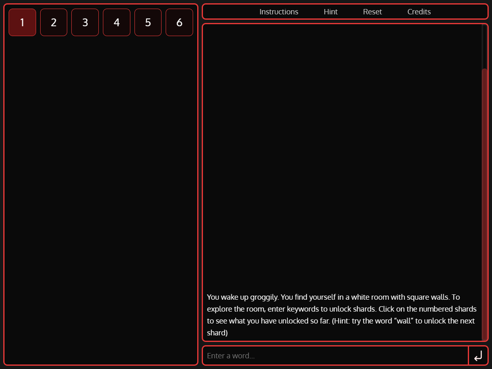
</p>

If the writer wants more granularity in the theme, they can change any of these numerous CSS variables.

<p align=center>
  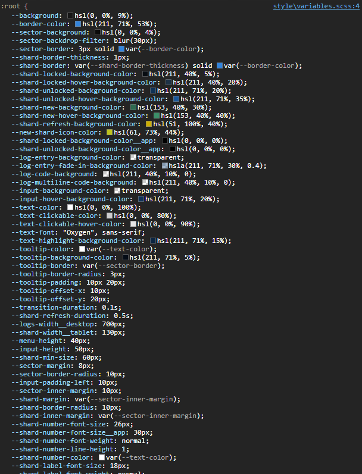
</p>

Or even write custom CSS styles. The layout is also defined with CSS grid, so the positions of the UI are easily reworked.

<p align=center>
  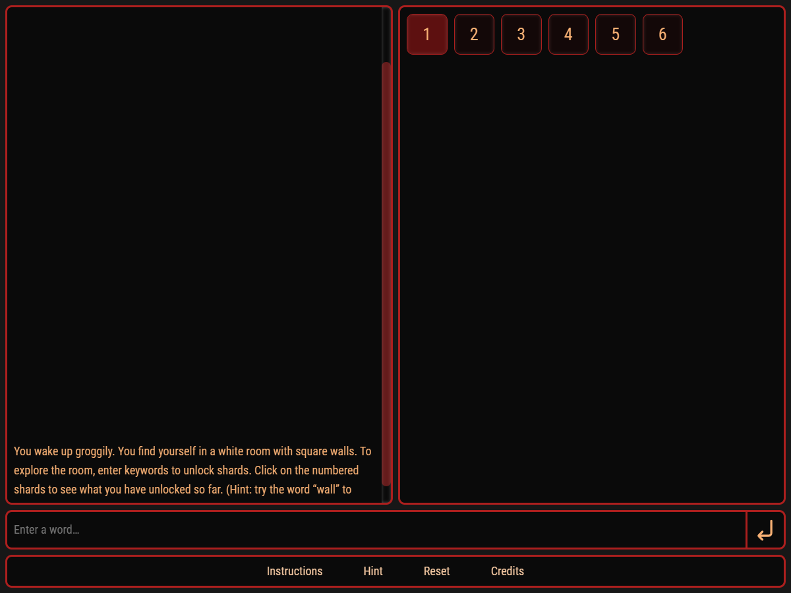
</p>

With that, I felt that I have done enough for the engine. I started writing the docs on how to use it, using the game engine itself! Do check it out <a href="/project/shard-game/?game=1oFHSagKPlhLtz_nwhesrETcb8IahRUdabKaIhv2LVRw" target="_blank" rel="noopener noreferrer">here</a>.

After publishing it, some writer friends came up with stories of their own. I’m only aware of these since they have shown me the results, but there are probably more out there that I’m not aware of. Note to self: add analytics to the game engine.

In the meantime, check out what people have done!

<p align=center>
  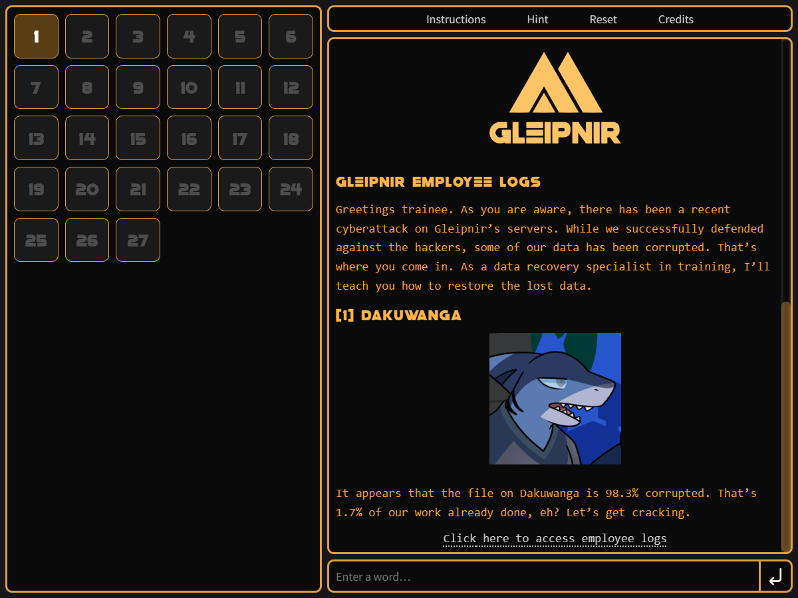
</p>

<p align=center>
  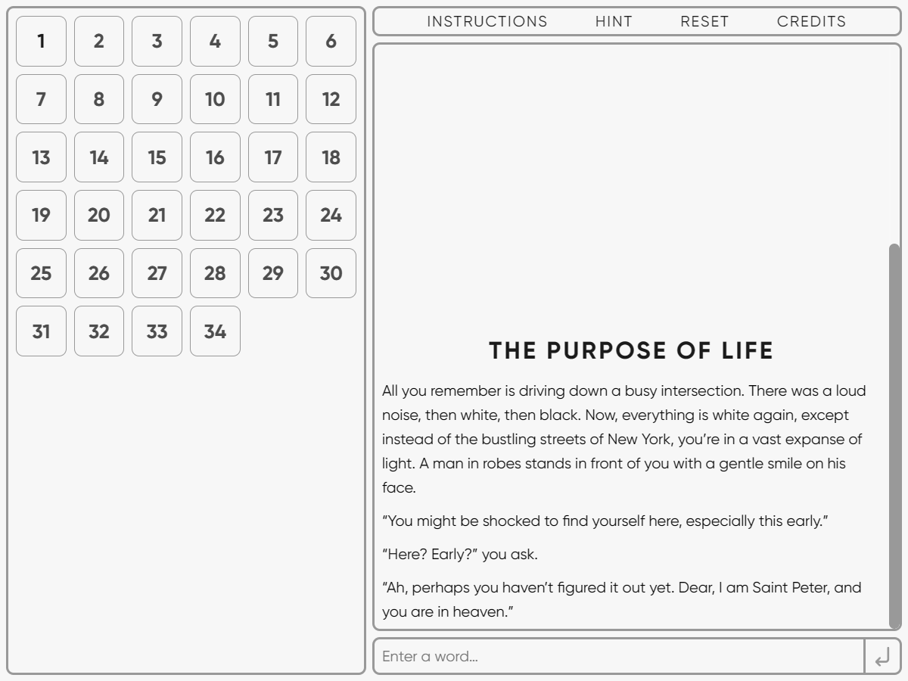
</p>

<p align=center>
  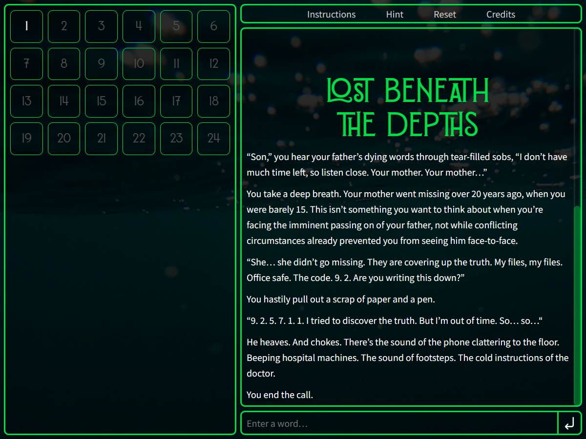
</p>


## The Heart of Storytelling

A lot of love went into this project. I think the passion comes from how the story format engages its players. Everyone interacts with the “Death of Immortality” in a different way. Some players focus on environmental details, and so they type keywords that unlock story fragments. Other players focus on the characters, and so their keywords lead them to explore the relationship aspects of the story. Every experience is unique, and it has been a fun journey watching players discover the story for themselves.

I hope that the game engine also leads people to create many more stories of their own too. After seeing the results, I’m glad to have spent time on this passion project in writing stories and coding a game.

You can check out Death of Immortality 
<a href="/project/shard-game/" target="_blank" rel="noopener noreferrer">here</a>. If you want to write your own Shard Story, you can find out how to do it <a href="/project/shard-game/?game=1oFHSagKPlhLtz_nwhesrETcb8IahRUdabKaIhv2LVRw" target="_blank" rel="noopener noreferrer">here</a>.