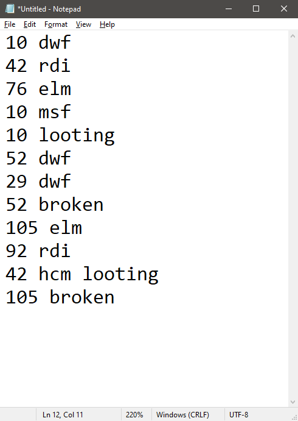

<header>

<h1>Snap Console</h1>

<p>Making a powerful console library with Python descriptors, context, and the curses library; all because of a game</p>

<p><a href="https://github.com/Kenneth-LJS/snap-console" target="_blank" rel="noopener noreferrer">GitHub</a> | <a href="https://pypi.org/project/snap-console/" target="_blank" rel="noopener noreferrer">PyPI</a></p>

</header>

## Raids and Notepad

As an avid RuneScape player, I attend the Warband raids event that regularly happens. Multiple camps spawn on different worlds, each with their own resources. Players have to loot the resources before the camps despawn.

I have a clan that does the raids. We station people across different worlds to locate and call out the camps. To optimise the calls, we use acronyms.

For instance, “12 dwf” means that a camp on world 12 has spawned at the DWF location (there are 3 locations: DWF, ELM, and RDI).

- “12 dwf” means that a camp on world 12 has spawned at the Dark Warrior Fortress.
    - There are 3 possible spawn locations: Dark Warrior Fortress (DWF), East Lava Maze (ELM), and Red Dragon Isle (RDI).
- “86 msf” means that the resources on the world 86 camp are Mining, Smithing, and Farming.
    - Camps spawn with 3 of 5 resources: Construction, Farming, Herblore, Mining, and Smithing.
- “104 looting” means that the camp on world 104 is ready to be looted.
   - Camps need to be cleared before looting.
- “49 broken" means that the camp on world 49 is broken.
   - Broken camps are camps that have failed to clear and cannot be looted.
- “19 8m” means that the camp on world 19 has 8 minutes of time left before despawning.

As the tracker, I keep track of the camps: the world, location, resources, and despawn time. To do that, I have my friend Notepad.exe.

<p align=center>
  
</p>

Not an ideal solution. I end up with duplicate worlds, scattered information (e.g. “15 dwf” on one line, and “15 msf” on another line), and I can’t even keep track of despawn times.

I turned to Python for help.

## Python
In the first version of my raid tracker, I basically took all the inputs and sorted them by the world number.

```python
world_calls = []

while True:
    user_input = input('Input: ')
    if user_input == 'exit':
        break

    world_calls.append(user_input)
    world_calls.sort(key=lambda input: int(input.split(' ')[0]))
    for world_call in world_calls:
        print(world_call)
    print()
```

Primitive, but it works.

```shell
Input: 10 dwf
10 dwf

Input: 42 rdi
10 dwf
42 rdi

Input: 10 msf
10 dwf
10 msf
42 rdi
```

With the world calls in order, it’s slightly easier to see calls organised by worlds.

But we can do better than this. After this, I added checks to combine the camp location, resources, and state.

```shell
Input: 10 dwf
10 dwf

Input: 42 rdi
10 dwf
42 rdi

Input: 10 msf
10 dwf msf
42 rdi

# The earlier call of 10 dwf was incorrect
# so we update its location to elm
Input: 10 elm
10 elm msf
42 rdi
```

Better, but there’s a final feature that the vanilla Python console cannot solve. I want to track the camp despawn times. If I type “10 8m”, I want the script to show an 8-minute countdown timer beside the world. We can’t do that here because:

1. The `input()` function is blocking, and nothing new can be printed until I enter something in the console.
2. Even if we used an asynchronous coroutine to do the printing, the world list will have to be reprinted every second to update the time, leading to a lot of flashing in the console.

How do we fix this?

## Print()
Let’s try to create a console that prints an incremental counter while echoing user input. First, we need an async function to handle the printing.

```python
async def console_counter():
    counter = 1
    while True:
        await asyncio.sleep(1)
        print(f'Counter: {counter}')
        counter += 1
```

Then we set up the script to run the coroutine asynchronously.

```python
import asyncio

async def main():
    asyncio.create_task(console_counter())

    # We'll take user input here
    
    await asyncio.sleep(10)

asyncio.run(main())
```

<p align=center>
  <video src="./static/counter.mp4" style="width: min(100%, 800px)" preload="auto" muted autoplay loop playsinline data-wf-ignore="true" data-object-fit="cover">
</p>

The display counts from 1 to 9, then the program terminates once the 10-second sleep has run out. Now, let’s take user input and echo it back to the user.

```python
async def main():
    asyncio.create_task(console_counter())

    print('Type anything and press "Enter"')
    while True:
        user_input = input()
        if len(user_input) == 0:
            exit()

        print('ECHO: ' + user_input)
```

Let’s check the printout.

<p align=center>
  <video src="./static/counter-input.mp4" style="width: min(100%, 800px)" preload="auto" muted autoplay loop playsinline data-wf-ignore="true" data-object-fit="cover">
</p>

Huh. The console counter doesn’t print the counts. It turns out that `input` is a blocking function, which means other coroutines cannot run while we are waiting for user input. To make this work, we have to use threads.

```python
import threading
import time

def console_counter():
    counter = 1
    while True:
        time.sleep(1)
        print(f'Counter: {counter}')
        counter += 1

console_counter_thread = threading.Thread(
    target=console_counter,
    daemon=True
)
console_counter_thread.start()

print('Type anything and press "Enter"')
while True:
    user_input = input()
    if len(user_input) == 0:
        exit()

    print('ECHO: ' + user_input)
```

<p align=center>
  <video src="./static/counter-threading-1.mp4" style="width: min(100%, 800px)" preload="auto" muted autoplay loop playsinline data-wf-ignore="true" data-object-fit="cover">
</p>

The two threads are trying to print over each other, causing the display issue we’re seeing in the demo. We can do a little hack by playing around with control characters.

- Printing `\r` brings the cursor to the start of the current row.
- Printing `\033[F` brings the cursor to the start of the previous row.
- Printing `\03[{n}G` moves the cursor `n` characters to the right.
- Printing `\x1b[2K` clears the current line, but keeps the cursor in the same location.

```python
START_OF_LINE = '\r'
LINE_UP = '\033[A'
LINE_CLEAR = '\x1b[2K'

print('Hello')
print('World!', end='')

'''
Hello
World!
'''

# Returns the cursor to start of row
print(START_OF_LINE, end='')

# Moves the cursor forward 2 characters
print('\033[3G', end='')

# Prints the characters `lf!` over `ord` that was
# previously printed at that position.
print('lf!', end='')

'''
Hello
Wolf!!
'''

# Move to the first row
print(LINE_UP, end='')

'''
Hello
Wolf!!
'''

# Clears the first row. The cursor is still at the
# 5th position on the first line.
print(LINE_CLEAR, end='')

# Prints "Hi" on the 5th position
print('Hi', end='')

'''
    Hi
Wolf!!
'''
```

If we apply these concepts to the previous script, we can achieve something like this:

```python
import threading
import time

def console_counter():
    counter = 1

    while True:
        time.sleep(1)

        # Go to the start of the current line
        print('\r', end='')

        # Print the counter and move down 1 line
        print(f'Counter: {counter}')

        counter += 1


console_counter_thread = threading.Thread(target=console_counter, daemon=True)
console_counter_thread.start()

print('Type anything and press "Enter"')

while True:
    user_input = input()
    if len(user_input) == 0:
        exit()

    print('ECHO: ' + user_input)
```

<p align=center>
  <video src="./static/counter-threading-2.mp4" style="width: min(100%, 800px)" preload="auto" muted autoplay loop playsinline data-wf-ignore="true" data-object-fit="cover">
</p>

Uh… no.

## Curses Library

While researching a less-janky solution, I stumbled across the “curses” library. curses handles screen-painting and keyboard-handling across various text-based terminals, be it VT100s, the Linux console, or other simulated terminals. Thankfully, there is also a Python wrapper for this module, which I quickly installed.

```shell
> pip install windows-curses
```

(Sorry, Mac and Unix users, it only works on Windows 😛)

After some experimentation, it turns out that the curses library is very low-level. For instance, this is how you’d print “Hello World”.

```python
from curses import wrapper

def main(stdscr):
    # Clear the screen
    stdscr.clear()

    # Print "Hello world!" as the coordinates (7, 5)
    stdscr.addstr(7, 5, 'Hello world!')

    # Ensures that the screen has been redrawn
    stdscr.refresh()
    
    # Wait for user input before exiting
    stdscr.getkey()

wrapper(main)
```

It also exposes a lot of low-level functionality that lets you take greater control of the console. For instance, you can refresh a specific portion of the screen if only that part has been changed. You can also define new areas called “pads” that can be rendered separately, then displayed on the screen. In short, you can optimise the display process for faster printing and less flashing.

But printing to the console on such a granular level is tedious. If I implemented my raid tracker with curses, at least 90% of my code will be handling the printing and updating of the console.

So I did what any reasonable developer would do: spend hundreds of hours building a new console library.

## Snap Console
Presenting the Snap Console. I wanted a library that would be easy to put together in a snap, hence the name.

Here are the features I wanted:

- Handle inputs and printing concurrently.
- More control over the order of printed lines.

What if I could modify the console output as if it were a list of rows? Something like this:

```python
console.logs.append('Row 1')
console.logs.append('Row 2')
console.logs += ['Row 3', 'Row 4']
console.logs.pop()
```

To do this, I needed to wrap a list so that when you modify it, we can trigger a callback. Thankfully, Python gives us a lot of power to override operators on your classes. For instance, we can use `__iadd__` to define how the `+` operator works on `WrappedList`s.

```python
class WrappedList(list):
    """Creates a list that calls a callback function on edit"""

    def __init__(self, callback, *args, **kwargs):
        super().__init__(*args, **kwargs)
        self.callback = callback

    def append(self, *args, **kwargs):
        result = super().append(*args, **kwargs)
        self.callback()
        return result

    def __iadd__(self, *args, **kwargs):
        result = super().__iadd__(*args, **kwargs)
        self.callback()
        return result

    # … Other operations
```

We can then add it to the `SnapConsole` class.

```python
class SnapConsole:    
    def __init__(self):
        self.logs = WrappedList(self.refresh, [])

    def refresh(self):
        # Placeholder function
        print('Update:', self.logs)
```

Now we can do:

```python
console = SnapConsole()
console.logs.append('Log 1')
console.logs.append('Log 2')
console.logs += ['Log 3', 'Log 4']
print(console.logs)
```

The output:

```shell
Update: ['Log 1']
Update: ['Log 1', 'Log 2']
Update: ['Log 1', 'Log 2', 'Log 3', 'Log 4']
```

This looks good so far. Each time we update the `logs` property, we can trigger a print callback. Let’s play around more.

```python
console.logs.append('Log 1')
console.logs.append('Log 2')
console.logs = ['Log 3', 'Log 4']
console.logs.append('Log 5')
```

The output:

```shell
Update: ['Log 1']
Update: ['Log 1', 'Log 2']
```

Huh, what happened here? It turns out that when we ran `console.logs = ['Log 3', 'Log 4']`, we replaced `console.logs` with a regular list rather than a wrapped one. We could force users to do something like this:

```python
console.logs = WrappedList(console.refresh, ['Log 3', 'Log 4'])
```

It works, but that’s really inelegant. Users are bound to forget to add the wrapper, leading to weird bugs throughout their code. Can we do better?

### Python Descriptors

Again, Python comes to the rescue. We can define a descriptor to manage the `logs` attribute.

```python
    class WrappedListDescriptor:
        def __init__(self, callback_name):
            # We save the name of the callback function for later access
            self.callback_name = callback_name

        def __set_name__(self, owner, name):
            # We store the `logs` variable as `_logs`.
            # This way, `logs` can be used as a property.
            self.private_name = '_' + name

        def __get__(self, instance, owner):
            # When accessing the `logs` property, return the private
            # `_logs` value if it is defined, otherwise initializes
            # an empty WrappedList
            cur_lst = getattr(instance, self.private_name, None)
            if cur_lst is None:
                callback = getattr(instance, self.callback_name, lambda: None)
                new_lst = WrappedList(callback, [])
                setattr(instance, self.private_name, new_lst)
                return new_lst
            return cur_lst

        def __set__(self, instance, new_lst):
            # Updates the `_logs` value with a wrapped version of the list

            cur_lst = getattr(instance, self.private_name, None)
            callback = getattr(instance, self.callback_name, lambda: None)
            if new_lst is not cur_lst:
                setattr(instance, self.private_name, WrappedList(callback, new_lst))
            callback()

        def __delete__(self, instance):
            # Do not allow the user to delete the `logs` attribute from the console
            raise AttributeError
```

I won’t go into detail of how it works, so if you’d like to learn more, check out <a href="https://docs.python.org/3/howto/descriptor.html" target="_blank" rel="noopener noreferrer">Python Descriptors</a>. Now, we can use it in SnapConsole.

```python
class SnapConsole:
    logs = WrappedListDescriptor('refresh')

    def __init__(self):
        self.logs = []

    def refresh(self):
        # Placeholder function
        print('Update:', self.logs)
```

We don’t even have to wrap the list in `__init__` because the descriptor does it for us! Now, when we run the following:

```python
console.logs.append('Log 1')
console.logs.append('Log 2')
console.logs = ['Log 3', 'Log 4']
console.logs.append('Log 5')
```

We get this:

```shell
Update: []
Update: ['Log 1']
Update: ['Log 1', 'Log 2']
Update: ['Log 3', 'Log 4']
Update: ['Log 3', 'Log 4', 'Log 5']
```

Sweet!

### Python Context
But we’re not done yet! It turns out that the curses library needs to be initialised with `curses.initscr()` and terminated with `curses.endwin()`. I’ve implemented `SnapConsole.start()` and `SnapConsole.stop()`, but what if the user forgets to call `stop()`?

For instance, take the following code:

```python
try:
    console = SnapConsole()
    console.start()
    # Do stuff
    console.stop()
except:
    pass
```

If an exception is thrown, we will exit the `try` block without closing the console! This happens way more often than we’d like to admit. Instead, can we do something like how `open` works?

```python
with open('filename.txt') as f:
    f.read()
```

Python once again comes to the rescue. By defining the `__enter__` and `__exit__` functions, we can achieve the same functionality.

```python
class SnapConsole:

    def __enter__(self):
        self.start()
        return self

    def __exit__(self, type, value, traceback):
        self.stop()
    
    # ... other functions
```

Now, we can simply start up SnapConsole like this:

```python
with SnapConsole() as console:
    console.logs = ['Success!']
```

And Python does all the work of closing the console for us. We’re left with defining the `refresh()` function. There’s a lot of nitty-gritty details to make it work, so I won’t go into it here.

But after hours of coding and debugging, we’re done! Let’s put it all together to create our counter script.

```python
import asyncio
from snapconsole import SnapConsole

async def console_counter(console):
    counter = 1
    while True:
        await asyncio.sleep(1)
        console.logs.append(f'Counter: {counter}')
        counter += 1

async def main():
    with SnapConsole() as console:
        asyncio.create_task(console_counter(console))

        async for user_input in console:
            if len(user_input) == 0:
                break
            console.logs.append(f'ECHO: {user_input}')

asyncio.run(main())
```

And now the test…

<p align=center>
  <video src="./static/counter-snap-console.mp4" style="width: min(100%, 800px)" preload="auto" muted autoplay loop playsinline data-wf-ignore="true" data-object-fit="cover">
</p>

Phew! Everything works fine.

I could go into everything I did for the Snap Console (colours, styles, headers, and more!), but this article is long enough. If you’d like to find out more about the features, check out the <a href="https://github.com/Kenneth-LJS/snap-console" target="_blank" rel="noopener noreferrer">documentation</a>.

In the meantime, though, it’s time to get back to the raids.

## Raids and Snap Console

With the Snap Console library done, I rewrote the raids tracker. Here’s the main logic:

```python
import asyncio
from snapconsole import SnapConsole, LogsAlignPosition, TextboxAlignPosition

def update_world_list(world_list, user_input):
    '''
        Insert logic to parse the user_input and
        update the world list with the changes
    '''
    return world_list

async def main():
    world_list = []

    with SnapConsole(
        textbox_align_position = TextboxAlignPosition.TOP,
        logs_align_position = LogsAlignPosition.TOP,
    ) as console:

        def refresh_worlds():
            console.logs = [str(world) for world in world_list]

        async def refresh_worlds_task():
            while True:
                refresh_worlds()
                await asyncio.sleep(1)
        refresh_task = asyncio.create_task(refresh_worlds_task())

        refresh_worlds()

        async for user_input in console:
            if user_input == 'exit':
                break

            world_list = update_world_list(world_list, user_input)
            refresh_worlds()

        refresh_task.cancel()

asyncio.run(main())
```

Coding this was surprisingly easier than expected. Let’s check if it works…

<p align=center>
  <video src="./static/raids-tracker.mp4" style="width: min(100%, 800px)" preload="auto" muted autoplay loop playsinline data-wf-ignore="true" data-object-fit="cover">
</p>

And it does! No hacky print statements and messy outputs: everything looks perfect. That’s what you get when you have an all-powerful console library to handle things for you.

You can install Snap Console on PyPI <a href="https://pypi.org/project/snap-console/" target="_blank" rel="noopener noreferrer">here</a> and start using it now! Otherwise, if you’d like to check out the open-source repository, you can find it <a href="https://github.com/Kenneth-LJS/snap-console" target="_blank" rel="noopener noreferrer">here</a>.